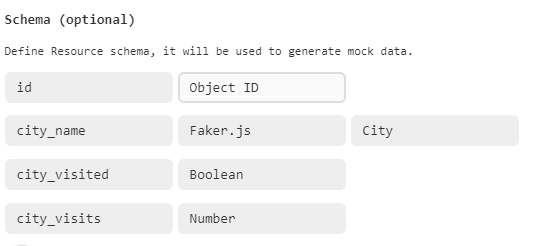
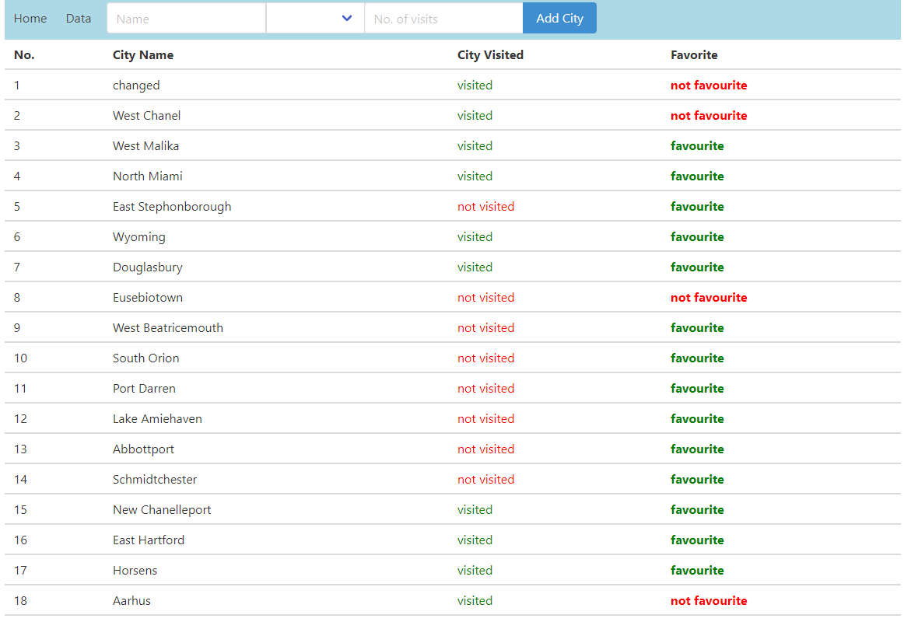

# Symfony Docker

A [Docker](https://www.docker.com/)-based installer and runtime for the [Symfony](https://symfony.com) web framework, with full [HTTP/2](https://symfony.com/doc/current/weblink.html), HTTP/3 and HTTPS support.

## Getting Started

1. If not already done, [install Docker Compose](https://docs.docker.com/compose/install/)
2. Run `docker-compose build --pull --no-cache` to build fresh images
3. Run `docker-compose up` (the logs will be displayed in the current shell)
4. Open `https://localhost` in your favorite web browser and [accept the auto-generated TLS certificate](https://stackoverflow.com/a/15076602/1352334)
5. Run `docker-compose down --remove-orphans` to stop the Docker containers.

**Commands used for attaching VueJS!**
1. composer require --dev symfony/maker-bundle
2. composer require symfony/webpack-encore-bundle
3. composer require doctrine/annotations
4. apk add nodejs yarn
5. yarn add vue
6. yarn add bulma

Run yarn watch for VueJS

###Libraries used:
1. BulmaCSS
2. WebPack Encore for injecting VueJS to Symfony

#Schema used from [this mockapi](https://mockapi.io)

## Features

* Production, development and CI ready
* Automatic HTTPS (in dev and in prod!)
* HTTP/2, HTTP/3 and [Preload](https://symfony.com/doc/current/web_link.html) support
* Built-in [Mercure](https://symfony.com/doc/current/mercure.html) hub
* [Vulcain](https://vulcain.rocks) support
* Just 2 services (PHP FPM and Caddy server)
* Super-readable configuration

##Screenshots

##Testing

White Box and Black Box testing were used as I have knowledge of the code. My main goal was to test the structure and the logic
 but also the functionality from a behavioral point of view.

Unit Testing is not needed as the assertions are mostly coming from an outer data layer becoming redundant as they need to be changed each time the data layer is changed. 
Some tests could have been implemented for the Services.js file in order to assert data.
I would have implemented Vue test utils if the App had been more complex.

Use cases tested:
1. Add a new city which is unique
2. Mark each city as visited (click on visited/not visited)
3. Cities with at least 3 visits should be automatically highlighted as favourite

Problems/bugs along the way:
1. Add a city with at least a visit and have it not visited (kind of silly)
2. Switch visited/not visited even if the city was visited or not (I left it like because there were no instructions regarding this functionality)
3. Webpack enabling for Vue dev-tools
4. Got ambitious to implement it with composition API.
5. Too much coffee :)

**Enjoy!**

## Docs

1. [Build options](docs/build.md)
2. [Using Symfony Docker with an existing project](docs/existing-project.md)
3. [Support for extra services](docs/extra-services.md)
4. [Deploying in production](docs/production.md)
5. [Installing Xdebug](docs/xdebug.md)
6. [Using a Makefile](docs/makefile.md)
7. [Troubleshooting](docs/troubleshooting.md)

## Credits

Created by [Kévin Dunglas](https://dunglas.fr), co-maintained by [Maxime Helias](https://twitter.com/maxhelias) and sponsored by [Les-Tilleuls.coop](https://les-tilleuls.coop).
